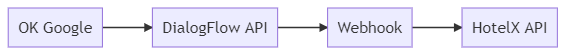

# Labx III
3th edition LabX travelgate

## Título
HotelX con flow y asistentes de voz

## Descripción
Crear un chatbot con DialogFlow que tenga interpretación de lenguaje natural y poder hacer una reserva a hotelX

## Primeros pasos

- Tener instalado Golang 1.13 https://golang.org/dl/
- Tener instalado insomnia https://insomnia.rest/
- Tener instalado visual code u otro editor o IDE para golang https://code.visualstudio.com/
- Tener una cuenta en DialogFlow https://dialogflow.cloud.google.com/#/login
- Webhook:
    - URL
    - Basic AUTH
    - Headers
    - https://cloud.google.com/dialogflow/docs/fulfillment-overview
- Docs de interés:
    - https://cloud.google.com/dialogflow/docs/fulfillment-how

## Arquitectura

## Propuesta

Crear un servicio en lenguaje golang (el webhook) que conecta con hotelx y poder realizar una conversación desde OK Google o Alexa.

Crearemos 2 Intents:

- Search
- Book

### Search
Intentará descifrar fechas y lugar y obtener la opción mas barata que tenga dispo, para ello tendremos que generar: 

- una petición a hotel-list (destination-searcher) para obtener los hoteles en un destino
- una petición a hotel-search con el plugin cheapestprice con el listado de hoteles anterior
- una petición a quote para comprobar que esté disponible y obtener las políticas.
- una petición a hotel-list (hotel) para obtener el contenido estático del hotel

#### Parámetros necesarios

- Fecha de inicio
- Fecha de fin
- Días de estancia
- Personas
- Lugar

### Book
Mediante lenguaje natural le diremos a Google nuestros datos necesarios para poder realizar una reserva, crearemos con todos los datos una petición a book y crearemos una reserva, de la cual le daremos al usuario el código de reserva.

#### Parámetros necesarios

## Objetivo

El objetivo principal es poder enseñar el producto de travelgateX, hotelX, utilizando nuevas tecnologías haciendo mención al principal objetivo de la empresa que es la innovación. Para ello, vamos a programar el webhook con golang utilizando buenas prácticas, creando tests, interfaces para abstraernos de la API y como es hotelX, con mucho humor.

